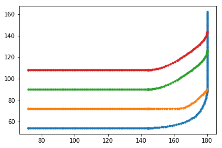

```python
import numpy as np
import matplotlib.pyplot as plt

from svg.path import parse_path
from svg.path.path import Line
from xml.dom import minidom

def line_splitter(start, end):
    return (lambda t: (1-t)*start+t*end)

def cubic_bezier_converter(start, control1, control2, end):
    original_data = np.array([start, control1, control2, end])
    cubic_bezier_matrix = np.array([
        [-1,  3, -3,  1],
        [ 3, -6,  3,  0],
        [-3,  3,  0,  0],
        [ 1,  0,  0,  0]
    ])
    return_data = cubic_bezier_matrix.dot(original_data)

    return (lambda t: np.array([t**3, t**2, t, 1]).dot(return_data))

# Learned from
# https://stackoverflow.com/questions/36971363/how-to-interpolate-svg-path-into-a-pixel-coordinates-not-simply-raster-in-pyth


doc = minidom.parse('LaneMap2.svg')
path_strings = [path.getAttribute('d') for path
                in doc.getElementsByTagName('path')]
doc.unlink()

points_np_all=[]
points_np_all=np.empty((len(path_strings)),dtype=object)
print(len(points_np_all))
#points_np_all[k]=np.array([])

for k in range(len(path_strings)):
#for path_string in path_strings:
    path = parse_path(path_strings[k])
    points_np_merge=np.empty((0,2), float)
    #points_np_merge=np.empty(points_np_merge)
    for dat in path:

#path=parse_path(path_strings[block])

#dat=path[key]

        if type(dat).__name__=='CubicBezier':
            start_np = np.array([dat.start.real, dat.start.imag])
            control1_np = np.array([dat.control1.real, dat.control1.imag])
            control2_np = np.array([dat.control2.real, dat.control2.imag])
            end_np = np.array([dat.end.real, dat.end.imag])
            converted_curve = cubic_bezier_converter(start_np, control1_np, control2_np, end_np)
            # 
            diff_np=start_np-end_np
            n_dots=np.round(np.linalg.norm(diff_np))
            # 
            points_np = np.array([converted_curve(t) for t in np.linspace(0, 1, n_dots)])
        elif type(dat).__name__=='Line':
            start_np = np.array([dat.start.real, dat.start.imag])
            end_np = np.array([dat.end.real, dat.end.imag])
            converted_line = line_splitter(start_np,end_np)
            # 
            diff_np=start_np-end_np
            n_dots=np.round(np.linalg.norm(diff_np))
            #     
            points_np=np.array([converted_line(t) for t in np.linspace(0, 1, n_dots)])
        elif type(dat).__name__=='Move':
            # 
            n_dots=1
            # 
            start_np = np.array([dat.start.real, dat.start.imag])
            end_np = np.array([dat.end.real, dat.end.imag])
            points_np = np.array([start_np,end_np])
        else:
            points_np=np.array([])
        #points_np_merge=np.concatenate(points_np_merge,points_np)
        points_np_merge=np.append(points_np_merge, points_np, axis=0)
#         if k==0:
#             points_np_merge=points_np
#         else:
#             points_np_merge=np.append(points_np_merge,points_np,axis=0)
        #plt.plot(points_np[:, 0], points_np[:, 1], '.-')
        #plt.show()
        #print(len(points_np))
        #print(len(points_np_merge))
    #points_np_all1=points_np_all1.append(points_np_merge)
    #points_np_all=points_np_merge
    points_np_all[k]= points_np_merge
#     points_np_all=points_np_all.append(points_np_merge)
    #print(len(points_np_all))
    print(' %d : %d dots' % (k,len(points_np_merge)))
    #plt.plot(points_np_merge[:, 0], points_np_merge[:, 1], '.-')
    #plt.show()


len(points_np_all)

len(points_np_all)
for k in range(len(points_np_all)):
    points_np=points_np_all[k]
    plt.plot(points_np[:, 0], points_np[:, 1], '.-')
plt.show()
    
```

    4
     0 : 202 dots
     1 : 117 dots
     2 : 126 dots
     3 : 126 dots





```python
import pandas as pd
# points_np.to_csv('to_csv_out_columns.csv')

df = pd.DataFrame({'x1': points_np[:,0],'y1': points_np[:,1],
                   'x2': points_np[:,0],'y2': points_np[:,1],
                   'x3': points_np[:,0],'y3': points_np[:,1],})
print(df)
df.to_csv('to_csv_out_columns.csv')
```

                 x1          y1          x2          y2          x3          y3
    0     72.000000  108.000000   72.000000  108.000000   72.000000  108.000000
    1     72.000000  108.000000   72.000000  108.000000   72.000000  108.000000
    2     72.000000  108.000000   72.000000  108.000000   72.000000  108.000000
    3     73.014085  108.000000   73.014085  108.000000   73.014085  108.000000
    4     74.028169  108.000000   74.028169  108.000000   74.028169  108.000000
    ..          ...         ...         ...         ...         ...         ...
    121  179.569803  140.516129  179.569803  140.516129  179.569803  140.516129
    122  179.755295  141.387097  179.755295  141.387097  179.755295  141.387097
    123  179.890034  142.258065  179.890034  142.258065  179.890034  142.258065
    124  179.972206  143.129032  179.972206  143.129032  179.972206  143.129032
    125  180.000000  144.000000  180.000000  144.000000  180.000000  144.000000
    
    [126 rows x 6 columns]


```python
len(points_np)
```


    126


```python
data={'x1': points_np[:,0],'y1': points_np[:,1]}
data=data.append({'x1': points_np[:,0],'y1': points_np[:,1]})
# data=data.append({'x1': points_np[:,0],'y1': points_np[:,1]})

merge_df = pd.DataFrame([], columns=merge_df.keys())

for k in range(len(points_np_all)):
    points_np=points_np_all[k]

    merge_df = merge_df.append('x1': points_np[:,0], ignore_index=True)

```


      File "<ipython-input-34-47be6a1e5b6b>", line 10
        merge_df = merge_df.append('x1': points_np[:,0], ignore_index=True)
                                       ^
    SyntaxError: invalid syntax


```python
from time import time
import pandas as pd

len(data)
label=[]
for k in range(len(points_np_all)):
    label=label.append('x1','y1')

dat_df = pd.DataFrame([],columns=['x1', 'y1'])
dat_df[0]={'x1': points_np[:,0],'y1': points_np[:,1]}
dat_df[1]={'x1': points_np[:,0],'y1': points_np[:,1]}
# data=data.append({'x1': points_np[:,0],'y1': points_np[:,1]})
dat_df[1]
```


    x1    x1
    y1    y1
    Name: 1, dtype: object


```python
label=np.empty([],dtype='unicode')
print(label.size)
label=[]
for k in range(len(points_np_all)): 
    xlabel="x%d"%(k+1)
    ylabel="y%d"%(k+1)
#     label=np.append(label,['x1','y1'])
    label=np.append(label,[xlabel,ylabel])
dat_df = pd.DataFrame([],columns=label)
for k in range(len(points_np_all)):
    points_np=points_np_all[k]
    dat_df[0]={'x1': points_np[:,0],'y1': points_np[:,1]}
#     label=np.append(label,'y1')
```

    1


```python
label=np.empty([],dtype='unicode')
print("label size = %d" % (label.size))
label=[]
for k in range(len(points_np_all)): 
    label=np.append(label,["x%d"%(k+1),"y%d"%(k+1)])
dat_df = pd.DataFrame([],columns=label)
for k in range(len(points_np_all)):
    points_np=points_np_all[k]
    print("%d: size = %d (length= %d)(shape= %s)" %(k,points_np.size,len(points_np),(points_np.shape)))
    #dat_df[0]={'x1': points_np[:,0],'y1': points_np[:,1]}
#     label=np.append(label,'y1')
```

    label size = 1
    0: size = 404 (length= 202)(shape= (202, 2))
    1: size = 234 (length= 117)(shape= (117, 2))
    2: size = 252 (length= 126)(shape= (126, 2))
    3: size = 252 (length= 126)(shape= (126, 2))


```python
maxL=max(len(points_np_all[k]) for k in range(len(points_np_all)))
print(maxL)
k=0
points_np=points_np_all[2]
g0=np.zeros([202,2])
tmp0=np.zeros([maxL,2])

print(len(g0))
print((g0.shape))
print(points_np.shape[0])
g0[0:126,:]=points_np
tmp0[0:points_np.shape[0],:]=points_np
print(len(tmp0))
print((tmp0.shape))
dat_df = pd.DataFrame([],columns=label)
dat_df["x1"]=tmp0[:,0]
dat_df["y1"]=tmp0[:,1]
dat_df
# tempdict={'x1':points_np_all[0][:,0],'y1':points_np_all[0][:,1],'x2':points_np_all[1][:,0],'y2':points_np_all[1][:,1],'x3':points_np_all[2][:,0],'y3':points_np_all[2][:,1],'x4':points_np_all[3][:,0],'y4':points_np_all[1][:,1]}
dat_df
# g2
# pd.DataFrame((2,3))
```

    202
    202
    (202, 2)
    126
    202
    (202, 2)


<div>
<style scoped>
    .dataframe tbody tr th:only-of-type {
        vertical-align: middle;
    }

    .dataframe tbody tr th {
        vertical-align: top;
    }

    .dataframe thead th {
        text-align: right;
    }
</style>
<table border="1" class="dataframe">
  <thead>
    <tr style="text-align: right;">
      <th></th>
      <th>x1</th>
      <th>y1</th>
      <th>x2</th>
      <th>y2</th>
      <th>x3</th>
      <th>y3</th>
      <th>x4</th>
      <th>y4</th>
    </tr>
  </thead>
  <tbody>
    <tr>
      <th>0</th>
      <td>180.000000</td>
      <td>126.000000</td>
      <td>NaN</td>
      <td>NaN</td>
      <td>NaN</td>
      <td>NaN</td>
      <td>NaN</td>
      <td>NaN</td>
    </tr>
    <tr>
      <th>1</th>
      <td>180.000000</td>
      <td>126.000000</td>
      <td>NaN</td>
      <td>NaN</td>
      <td>NaN</td>
      <td>NaN</td>
      <td>NaN</td>
      <td>NaN</td>
    </tr>
    <tr>
      <th>2</th>
      <td>180.000000</td>
      <td>126.000000</td>
      <td>NaN</td>
      <td>NaN</td>
      <td>NaN</td>
      <td>NaN</td>
      <td>NaN</td>
      <td>NaN</td>
    </tr>
    <tr>
      <th>3</th>
      <td>179.972206</td>
      <td>125.129032</td>
      <td>NaN</td>
      <td>NaN</td>
      <td>NaN</td>
      <td>NaN</td>
      <td>NaN</td>
      <td>NaN</td>
    </tr>
    <tr>
      <th>4</th>
      <td>179.890034</td>
      <td>124.258065</td>
      <td>NaN</td>
      <td>NaN</td>
      <td>NaN</td>
      <td>NaN</td>
      <td>NaN</td>
      <td>NaN</td>
    </tr>
    <tr>
      <th>5</th>
      <td>179.755295</td>
      <td>123.387097</td>
      <td>NaN</td>
      <td>NaN</td>
      <td>NaN</td>
      <td>NaN</td>
      <td>NaN</td>
      <td>NaN</td>
    </tr>
    <tr>
      <th>6</th>
      <td>179.569803</td>
      <td>122.516129</td>
      <td>NaN</td>
      <td>NaN</td>
      <td>NaN</td>
      <td>NaN</td>
      <td>NaN</td>
      <td>NaN</td>
    </tr>
    <tr>
      <th>7</th>
      <td>179.335370</td>
      <td>121.645161</td>
      <td>NaN</td>
      <td>NaN</td>
      <td>NaN</td>
      <td>NaN</td>
      <td>NaN</td>
      <td>NaN</td>
    </tr>
    <tr>
      <th>8</th>
      <td>179.053808</td>
      <td>120.774194</td>
      <td>NaN</td>
      <td>NaN</td>
      <td>NaN</td>
      <td>NaN</td>
      <td>NaN</td>
      <td>NaN</td>
    </tr>
    <tr>
      <th>9</th>
      <td>178.726931</td>
      <td>119.903226</td>
      <td>NaN</td>
      <td>NaN</td>
      <td>NaN</td>
      <td>NaN</td>
      <td>NaN</td>
      <td>NaN</td>
    </tr>
    <tr>
      <th>10</th>
      <td>178.356551</td>
      <td>119.032258</td>
      <td>NaN</td>
      <td>NaN</td>
      <td>NaN</td>
      <td>NaN</td>
      <td>NaN</td>
      <td>NaN</td>
    </tr>
    <tr>
      <th>11</th>
      <td>177.944480</td>
      <td>118.161290</td>
      <td>NaN</td>
      <td>NaN</td>
      <td>NaN</td>
      <td>NaN</td>
      <td>NaN</td>
      <td>NaN</td>
    </tr>
    <tr>
      <th>12</th>
      <td>177.492531</td>
      <td>117.290323</td>
      <td>NaN</td>
      <td>NaN</td>
      <td>NaN</td>
      <td>NaN</td>
      <td>NaN</td>
      <td>NaN</td>
    </tr>
    <tr>
      <th>13</th>
      <td>177.002518</td>
      <td>116.419355</td>
      <td>NaN</td>
      <td>NaN</td>
      <td>NaN</td>
      <td>NaN</td>
      <td>NaN</td>
      <td>NaN</td>
    </tr>
    <tr>
      <th>14</th>
      <td>176.476251</td>
      <td>115.548387</td>
      <td>NaN</td>
      <td>NaN</td>
      <td>NaN</td>
      <td>NaN</td>
      <td>NaN</td>
      <td>NaN</td>
    </tr>
    <tr>
      <th>15</th>
      <td>175.915545</td>
      <td>114.677419</td>
      <td>NaN</td>
      <td>NaN</td>
      <td>NaN</td>
      <td>NaN</td>
      <td>NaN</td>
      <td>NaN</td>
    </tr>
    <tr>
      <th>16</th>
      <td>175.322211</td>
      <td>113.806452</td>
      <td>NaN</td>
      <td>NaN</td>
      <td>NaN</td>
      <td>NaN</td>
      <td>NaN</td>
      <td>NaN</td>
    </tr>
    <tr>
      <th>17</th>
      <td>174.698063</td>
      <td>112.935484</td>
      <td>NaN</td>
      <td>NaN</td>
      <td>NaN</td>
      <td>NaN</td>
      <td>NaN</td>
      <td>NaN</td>
    </tr>
    <tr>
      <th>18</th>
      <td>174.044913</td>
      <td>112.064516</td>
      <td>NaN</td>
      <td>NaN</td>
      <td>NaN</td>
      <td>NaN</td>
      <td>NaN</td>
      <td>NaN</td>
    </tr>
    <tr>
      <th>19</th>
      <td>173.364573</td>
      <td>111.193548</td>
      <td>NaN</td>
      <td>NaN</td>
      <td>NaN</td>
      <td>NaN</td>
      <td>NaN</td>
      <td>NaN</td>
    </tr>
    <tr>
      <th>20</th>
      <td>172.658857</td>
      <td>110.322581</td>
      <td>NaN</td>
      <td>NaN</td>
      <td>NaN</td>
      <td>NaN</td>
      <td>NaN</td>
      <td>NaN</td>
    </tr>
    <tr>
      <th>21</th>
      <td>171.929576</td>
      <td>109.451613</td>
      <td>NaN</td>
      <td>NaN</td>
      <td>NaN</td>
      <td>NaN</td>
      <td>NaN</td>
      <td>NaN</td>
    </tr>
    <tr>
      <th>22</th>
      <td>171.178544</td>
      <td>108.580645</td>
      <td>NaN</td>
      <td>NaN</td>
      <td>NaN</td>
      <td>NaN</td>
      <td>NaN</td>
      <td>NaN</td>
    </tr>
    <tr>
      <th>23</th>
      <td>170.407573</td>
      <td>107.709677</td>
      <td>NaN</td>
      <td>NaN</td>
      <td>NaN</td>
      <td>NaN</td>
      <td>NaN</td>
      <td>NaN</td>
    </tr>
    <tr>
      <th>24</th>
      <td>169.618475</td>
      <td>106.838710</td>
      <td>NaN</td>
      <td>NaN</td>
      <td>NaN</td>
      <td>NaN</td>
      <td>NaN</td>
      <td>NaN</td>
    </tr>
    <tr>
      <th>25</th>
      <td>168.813064</td>
      <td>105.967742</td>
      <td>NaN</td>
      <td>NaN</td>
      <td>NaN</td>
      <td>NaN</td>
      <td>NaN</td>
      <td>NaN</td>
    </tr>
    <tr>
      <th>26</th>
      <td>167.993152</td>
      <td>105.096774</td>
      <td>NaN</td>
      <td>NaN</td>
      <td>NaN</td>
      <td>NaN</td>
      <td>NaN</td>
      <td>NaN</td>
    </tr>
    <tr>
      <th>27</th>
      <td>167.160552</td>
      <td>104.225806</td>
      <td>NaN</td>
      <td>NaN</td>
      <td>NaN</td>
      <td>NaN</td>
      <td>NaN</td>
      <td>NaN</td>
    </tr>
    <tr>
      <th>28</th>
      <td>166.317076</td>
      <td>103.354839</td>
      <td>NaN</td>
      <td>NaN</td>
      <td>NaN</td>
      <td>NaN</td>
      <td>NaN</td>
      <td>NaN</td>
    </tr>
    <tr>
      <th>29</th>
      <td>165.464536</td>
      <td>102.483871</td>
      <td>NaN</td>
      <td>NaN</td>
      <td>NaN</td>
      <td>NaN</td>
      <td>NaN</td>
      <td>NaN</td>
    </tr>
    <tr>
      <th>...</th>
      <td>...</td>
      <td>...</td>
      <td>...</td>
      <td>...</td>
      <td>...</td>
      <td>...</td>
      <td>...</td>
      <td>...</td>
    </tr>
    <tr>
      <th>172</th>
      <td>0.000000</td>
      <td>0.000000</td>
      <td>NaN</td>
      <td>NaN</td>
      <td>NaN</td>
      <td>NaN</td>
      <td>NaN</td>
      <td>NaN</td>
    </tr>
    <tr>
      <th>173</th>
      <td>0.000000</td>
      <td>0.000000</td>
      <td>NaN</td>
      <td>NaN</td>
      <td>NaN</td>
      <td>NaN</td>
      <td>NaN</td>
      <td>NaN</td>
    </tr>
    <tr>
      <th>174</th>
      <td>0.000000</td>
      <td>0.000000</td>
      <td>NaN</td>
      <td>NaN</td>
      <td>NaN</td>
      <td>NaN</td>
      <td>NaN</td>
      <td>NaN</td>
    </tr>
    <tr>
      <th>175</th>
      <td>0.000000</td>
      <td>0.000000</td>
      <td>NaN</td>
      <td>NaN</td>
      <td>NaN</td>
      <td>NaN</td>
      <td>NaN</td>
      <td>NaN</td>
    </tr>
    <tr>
      <th>176</th>
      <td>0.000000</td>
      <td>0.000000</td>
      <td>NaN</td>
      <td>NaN</td>
      <td>NaN</td>
      <td>NaN</td>
      <td>NaN</td>
      <td>NaN</td>
    </tr>
    <tr>
      <th>177</th>
      <td>0.000000</td>
      <td>0.000000</td>
      <td>NaN</td>
      <td>NaN</td>
      <td>NaN</td>
      <td>NaN</td>
      <td>NaN</td>
      <td>NaN</td>
    </tr>
    <tr>
      <th>178</th>
      <td>0.000000</td>
      <td>0.000000</td>
      <td>NaN</td>
      <td>NaN</td>
      <td>NaN</td>
      <td>NaN</td>
      <td>NaN</td>
      <td>NaN</td>
    </tr>
    <tr>
      <th>179</th>
      <td>0.000000</td>
      <td>0.000000</td>
      <td>NaN</td>
      <td>NaN</td>
      <td>NaN</td>
      <td>NaN</td>
      <td>NaN</td>
      <td>NaN</td>
    </tr>
    <tr>
      <th>180</th>
      <td>0.000000</td>
      <td>0.000000</td>
      <td>NaN</td>
      <td>NaN</td>
      <td>NaN</td>
      <td>NaN</td>
      <td>NaN</td>
      <td>NaN</td>
    </tr>
    <tr>
      <th>181</th>
      <td>0.000000</td>
      <td>0.000000</td>
      <td>NaN</td>
      <td>NaN</td>
      <td>NaN</td>
      <td>NaN</td>
      <td>NaN</td>
      <td>NaN</td>
    </tr>
    <tr>
      <th>182</th>
      <td>0.000000</td>
      <td>0.000000</td>
      <td>NaN</td>
      <td>NaN</td>
      <td>NaN</td>
      <td>NaN</td>
      <td>NaN</td>
      <td>NaN</td>
    </tr>
    <tr>
      <th>183</th>
      <td>0.000000</td>
      <td>0.000000</td>
      <td>NaN</td>
      <td>NaN</td>
      <td>NaN</td>
      <td>NaN</td>
      <td>NaN</td>
      <td>NaN</td>
    </tr>
    <tr>
      <th>184</th>
      <td>0.000000</td>
      <td>0.000000</td>
      <td>NaN</td>
      <td>NaN</td>
      <td>NaN</td>
      <td>NaN</td>
      <td>NaN</td>
      <td>NaN</td>
    </tr>
    <tr>
      <th>185</th>
      <td>0.000000</td>
      <td>0.000000</td>
      <td>NaN</td>
      <td>NaN</td>
      <td>NaN</td>
      <td>NaN</td>
      <td>NaN</td>
      <td>NaN</td>
    </tr>
    <tr>
      <th>186</th>
      <td>0.000000</td>
      <td>0.000000</td>
      <td>NaN</td>
      <td>NaN</td>
      <td>NaN</td>
      <td>NaN</td>
      <td>NaN</td>
      <td>NaN</td>
    </tr>
    <tr>
      <th>187</th>
      <td>0.000000</td>
      <td>0.000000</td>
      <td>NaN</td>
      <td>NaN</td>
      <td>NaN</td>
      <td>NaN</td>
      <td>NaN</td>
      <td>NaN</td>
    </tr>
    <tr>
      <th>188</th>
      <td>0.000000</td>
      <td>0.000000</td>
      <td>NaN</td>
      <td>NaN</td>
      <td>NaN</td>
      <td>NaN</td>
      <td>NaN</td>
      <td>NaN</td>
    </tr>
    <tr>
      <th>189</th>
      <td>0.000000</td>
      <td>0.000000</td>
      <td>NaN</td>
      <td>NaN</td>
      <td>NaN</td>
      <td>NaN</td>
      <td>NaN</td>
      <td>NaN</td>
    </tr>
    <tr>
      <th>190</th>
      <td>0.000000</td>
      <td>0.000000</td>
      <td>NaN</td>
      <td>NaN</td>
      <td>NaN</td>
      <td>NaN</td>
      <td>NaN</td>
      <td>NaN</td>
    </tr>
    <tr>
      <th>191</th>
      <td>0.000000</td>
      <td>0.000000</td>
      <td>NaN</td>
      <td>NaN</td>
      <td>NaN</td>
      <td>NaN</td>
      <td>NaN</td>
      <td>NaN</td>
    </tr>
    <tr>
      <th>192</th>
      <td>0.000000</td>
      <td>0.000000</td>
      <td>NaN</td>
      <td>NaN</td>
      <td>NaN</td>
      <td>NaN</td>
      <td>NaN</td>
      <td>NaN</td>
    </tr>
    <tr>
      <th>193</th>
      <td>0.000000</td>
      <td>0.000000</td>
      <td>NaN</td>
      <td>NaN</td>
      <td>NaN</td>
      <td>NaN</td>
      <td>NaN</td>
      <td>NaN</td>
    </tr>
    <tr>
      <th>194</th>
      <td>0.000000</td>
      <td>0.000000</td>
      <td>NaN</td>
      <td>NaN</td>
      <td>NaN</td>
      <td>NaN</td>
      <td>NaN</td>
      <td>NaN</td>
    </tr>
    <tr>
      <th>195</th>
      <td>0.000000</td>
      <td>0.000000</td>
      <td>NaN</td>
      <td>NaN</td>
      <td>NaN</td>
      <td>NaN</td>
      <td>NaN</td>
      <td>NaN</td>
    </tr>
    <tr>
      <th>196</th>
      <td>0.000000</td>
      <td>0.000000</td>
      <td>NaN</td>
      <td>NaN</td>
      <td>NaN</td>
      <td>NaN</td>
      <td>NaN</td>
      <td>NaN</td>
    </tr>
    <tr>
      <th>197</th>
      <td>0.000000</td>
      <td>0.000000</td>
      <td>NaN</td>
      <td>NaN</td>
      <td>NaN</td>
      <td>NaN</td>
      <td>NaN</td>
      <td>NaN</td>
    </tr>
    <tr>
      <th>198</th>
      <td>0.000000</td>
      <td>0.000000</td>
      <td>NaN</td>
      <td>NaN</td>
      <td>NaN</td>
      <td>NaN</td>
      <td>NaN</td>
      <td>NaN</td>
    </tr>
    <tr>
      <th>199</th>
      <td>0.000000</td>
      <td>0.000000</td>
      <td>NaN</td>
      <td>NaN</td>
      <td>NaN</td>
      <td>NaN</td>
      <td>NaN</td>
      <td>NaN</td>
    </tr>
    <tr>
      <th>200</th>
      <td>0.000000</td>
      <td>0.000000</td>
      <td>NaN</td>
      <td>NaN</td>
      <td>NaN</td>
      <td>NaN</td>
      <td>NaN</td>
      <td>NaN</td>
    </tr>
    <tr>
      <th>201</th>
      <td>0.000000</td>
      <td>0.000000</td>
      <td>NaN</td>
      <td>NaN</td>
      <td>NaN</td>
      <td>NaN</td>
      <td>NaN</td>
      <td>NaN</td>
    </tr>
  </tbody>
</table>
<p>202 rows × 8 columns</p>
</div>


```python
maxL=max(len(points_np_all[k]) for k in range(len(points_np_all)))

label=np.empty([],dtype='unicode')
print("label size = %d" % (label.size))
label=[]
for k in range(len(points_np_all)): 
    label=np.append(label,["x%d"%(k+1),"y%d"%(k+1)])
dat_df = pd.DataFrame([],columns=label)
for k in range(len(points_np_all)):
    points_np=points_np_all[k]
    tmp0=np.zeros([maxL,2])
    tmp0[0:points_np.shape[0],:]=points_np
    dat_df["x%d"%(k+1)] = tmp0[:,0]
    dat_df["y%d"%(k+1)] = tmp0[:,1]
    
print(dat_df.shape)
dat_df
```

    label size = 1
    (202, 8)


<div>
<style scoped>
    .dataframe tbody tr th:only-of-type {
        vertical-align: middle;
    }

    .dataframe tbody tr th {
        vertical-align: top;
    }

    .dataframe thead th {
        text-align: right;
    }
</style>
<table border="1" class="dataframe">
  <thead>
    <tr style="text-align: right;">
      <th></th>
      <th>x1</th>
      <th>y1</th>
      <th>x2</th>
      <th>y2</th>
      <th>x3</th>
      <th>y3</th>
      <th>x4</th>
      <th>y4</th>
    </tr>
  </thead>
  <tbody>
    <tr>
      <th>0</th>
      <td>72.000000</td>
      <td>54.000000</td>
      <td>72.000000</td>
      <td>72.0</td>
      <td>180.000000</td>
      <td>126.000000</td>
      <td>72.000000</td>
      <td>108.0</td>
    </tr>
    <tr>
      <th>1</th>
      <td>72.000000</td>
      <td>54.000000</td>
      <td>72.000000</td>
      <td>72.0</td>
      <td>180.000000</td>
      <td>126.000000</td>
      <td>72.000000</td>
      <td>108.0</td>
    </tr>
    <tr>
      <th>2</th>
      <td>72.000000</td>
      <td>54.000000</td>
      <td>72.000000</td>
      <td>72.0</td>
      <td>180.000000</td>
      <td>126.000000</td>
      <td>72.000000</td>
      <td>108.0</td>
    </tr>
    <tr>
      <th>3</th>
      <td>73.014085</td>
      <td>54.000000</td>
      <td>73.014085</td>
      <td>72.0</td>
      <td>179.972206</td>
      <td>125.129032</td>
      <td>73.014085</td>
      <td>108.0</td>
    </tr>
    <tr>
      <th>4</th>
      <td>74.028169</td>
      <td>54.000000</td>
      <td>74.028169</td>
      <td>72.0</td>
      <td>179.890034</td>
      <td>124.258065</td>
      <td>74.028169</td>
      <td>108.0</td>
    </tr>
    <tr>
      <th>5</th>
      <td>75.042254</td>
      <td>54.000000</td>
      <td>75.042254</td>
      <td>72.0</td>
      <td>179.755295</td>
      <td>123.387097</td>
      <td>75.042254</td>
      <td>108.0</td>
    </tr>
    <tr>
      <th>6</th>
      <td>76.056338</td>
      <td>54.000000</td>
      <td>76.056338</td>
      <td>72.0</td>
      <td>179.569803</td>
      <td>122.516129</td>
      <td>76.056338</td>
      <td>108.0</td>
    </tr>
    <tr>
      <th>7</th>
      <td>77.070423</td>
      <td>54.000000</td>
      <td>77.070423</td>
      <td>72.0</td>
      <td>179.335370</td>
      <td>121.645161</td>
      <td>77.070423</td>
      <td>108.0</td>
    </tr>
    <tr>
      <th>8</th>
      <td>78.084507</td>
      <td>54.000000</td>
      <td>78.084507</td>
      <td>72.0</td>
      <td>179.053808</td>
      <td>120.774194</td>
      <td>78.084507</td>
      <td>108.0</td>
    </tr>
    <tr>
      <th>9</th>
      <td>79.098592</td>
      <td>54.000000</td>
      <td>79.098592</td>
      <td>72.0</td>
      <td>178.726931</td>
      <td>119.903226</td>
      <td>79.098592</td>
      <td>108.0</td>
    </tr>
    <tr>
      <th>10</th>
      <td>80.112676</td>
      <td>54.000000</td>
      <td>80.112676</td>
      <td>72.0</td>
      <td>178.356551</td>
      <td>119.032258</td>
      <td>80.112676</td>
      <td>108.0</td>
    </tr>
    <tr>
      <th>11</th>
      <td>81.126761</td>
      <td>54.000000</td>
      <td>81.126761</td>
      <td>72.0</td>
      <td>177.944480</td>
      <td>118.161290</td>
      <td>81.126761</td>
      <td>108.0</td>
    </tr>
    <tr>
      <th>12</th>
      <td>82.140845</td>
      <td>54.000000</td>
      <td>82.140845</td>
      <td>72.0</td>
      <td>177.492531</td>
      <td>117.290323</td>
      <td>82.140845</td>
      <td>108.0</td>
    </tr>
    <tr>
      <th>13</th>
      <td>83.154930</td>
      <td>54.000000</td>
      <td>83.154930</td>
      <td>72.0</td>
      <td>177.002518</td>
      <td>116.419355</td>
      <td>83.154930</td>
      <td>108.0</td>
    </tr>
    <tr>
      <th>14</th>
      <td>84.169014</td>
      <td>54.000000</td>
      <td>84.169014</td>
      <td>72.0</td>
      <td>176.476251</td>
      <td>115.548387</td>
      <td>84.169014</td>
      <td>108.0</td>
    </tr>
    <tr>
      <th>15</th>
      <td>85.183099</td>
      <td>54.000000</td>
      <td>85.183099</td>
      <td>72.0</td>
      <td>175.915545</td>
      <td>114.677419</td>
      <td>85.183099</td>
      <td>108.0</td>
    </tr>
    <tr>
      <th>16</th>
      <td>86.197183</td>
      <td>54.000000</td>
      <td>86.197183</td>
      <td>72.0</td>
      <td>175.322211</td>
      <td>113.806452</td>
      <td>86.197183</td>
      <td>108.0</td>
    </tr>
    <tr>
      <th>17</th>
      <td>87.211268</td>
      <td>54.000000</td>
      <td>87.211268</td>
      <td>72.0</td>
      <td>174.698063</td>
      <td>112.935484</td>
      <td>87.211268</td>
      <td>108.0</td>
    </tr>
    <tr>
      <th>18</th>
      <td>88.225352</td>
      <td>54.000000</td>
      <td>88.225352</td>
      <td>72.0</td>
      <td>174.044913</td>
      <td>112.064516</td>
      <td>88.225352</td>
      <td>108.0</td>
    </tr>
    <tr>
      <th>19</th>
      <td>89.239437</td>
      <td>54.000000</td>
      <td>89.239437</td>
      <td>72.0</td>
      <td>173.364573</td>
      <td>111.193548</td>
      <td>89.239437</td>
      <td>108.0</td>
    </tr>
    <tr>
      <th>20</th>
      <td>90.253521</td>
      <td>54.000000</td>
      <td>90.253521</td>
      <td>72.0</td>
      <td>172.658857</td>
      <td>110.322581</td>
      <td>90.253521</td>
      <td>108.0</td>
    </tr>
    <tr>
      <th>21</th>
      <td>91.267606</td>
      <td>54.000000</td>
      <td>91.267606</td>
      <td>72.0</td>
      <td>171.929576</td>
      <td>109.451613</td>
      <td>91.267606</td>
      <td>108.0</td>
    </tr>
    <tr>
      <th>22</th>
      <td>92.281690</td>
      <td>54.000000</td>
      <td>92.281690</td>
      <td>72.0</td>
      <td>171.178544</td>
      <td>108.580645</td>
      <td>92.281690</td>
      <td>108.0</td>
    </tr>
    <tr>
      <th>23</th>
      <td>93.295775</td>
      <td>54.000000</td>
      <td>93.295775</td>
      <td>72.0</td>
      <td>170.407573</td>
      <td>107.709677</td>
      <td>93.295775</td>
      <td>108.0</td>
    </tr>
    <tr>
      <th>24</th>
      <td>94.309859</td>
      <td>54.000000</td>
      <td>94.309859</td>
      <td>72.0</td>
      <td>169.618475</td>
      <td>106.838710</td>
      <td>94.309859</td>
      <td>108.0</td>
    </tr>
    <tr>
      <th>25</th>
      <td>95.323944</td>
      <td>54.000000</td>
      <td>95.323944</td>
      <td>72.0</td>
      <td>168.813064</td>
      <td>105.967742</td>
      <td>95.323944</td>
      <td>108.0</td>
    </tr>
    <tr>
      <th>26</th>
      <td>96.338028</td>
      <td>54.000000</td>
      <td>96.338028</td>
      <td>72.0</td>
      <td>167.993152</td>
      <td>105.096774</td>
      <td>96.338028</td>
      <td>108.0</td>
    </tr>
    <tr>
      <th>27</th>
      <td>97.352113</td>
      <td>54.000000</td>
      <td>97.352113</td>
      <td>72.0</td>
      <td>167.160552</td>
      <td>104.225806</td>
      <td>97.352113</td>
      <td>108.0</td>
    </tr>
    <tr>
      <th>28</th>
      <td>98.366197</td>
      <td>54.000000</td>
      <td>98.366197</td>
      <td>72.0</td>
      <td>166.317076</td>
      <td>103.354839</td>
      <td>98.366197</td>
      <td>108.0</td>
    </tr>
    <tr>
      <th>29</th>
      <td>99.380282</td>
      <td>54.000000</td>
      <td>99.380282</td>
      <td>72.0</td>
      <td>165.464536</td>
      <td>102.483871</td>
      <td>99.380282</td>
      <td>108.0</td>
    </tr>
    <tr>
      <th>...</th>
      <td>...</td>
      <td>...</td>
      <td>...</td>
      <td>...</td>
      <td>...</td>
      <td>...</td>
      <td>...</td>
      <td>...</td>
    </tr>
    <tr>
      <th>172</th>
      <td>180.000000</td>
      <td>132.591549</td>
      <td>0.000000</td>
      <td>0.0</td>
      <td>0.000000</td>
      <td>0.000000</td>
      <td>0.000000</td>
      <td>0.0</td>
    </tr>
    <tr>
      <th>173</th>
      <td>180.000000</td>
      <td>133.605634</td>
      <td>0.000000</td>
      <td>0.0</td>
      <td>0.000000</td>
      <td>0.000000</td>
      <td>0.000000</td>
      <td>0.0</td>
    </tr>
    <tr>
      <th>174</th>
      <td>180.000000</td>
      <td>134.619718</td>
      <td>0.000000</td>
      <td>0.0</td>
      <td>0.000000</td>
      <td>0.000000</td>
      <td>0.000000</td>
      <td>0.0</td>
    </tr>
    <tr>
      <th>175</th>
      <td>180.000000</td>
      <td>135.633803</td>
      <td>0.000000</td>
      <td>0.0</td>
      <td>0.000000</td>
      <td>0.000000</td>
      <td>0.000000</td>
      <td>0.0</td>
    </tr>
    <tr>
      <th>176</th>
      <td>180.000000</td>
      <td>136.647887</td>
      <td>0.000000</td>
      <td>0.0</td>
      <td>0.000000</td>
      <td>0.000000</td>
      <td>0.000000</td>
      <td>0.0</td>
    </tr>
    <tr>
      <th>177</th>
      <td>180.000000</td>
      <td>137.661972</td>
      <td>0.000000</td>
      <td>0.0</td>
      <td>0.000000</td>
      <td>0.000000</td>
      <td>0.000000</td>
      <td>0.0</td>
    </tr>
    <tr>
      <th>178</th>
      <td>180.000000</td>
      <td>138.676056</td>
      <td>0.000000</td>
      <td>0.0</td>
      <td>0.000000</td>
      <td>0.000000</td>
      <td>0.000000</td>
      <td>0.0</td>
    </tr>
    <tr>
      <th>179</th>
      <td>180.000000</td>
      <td>139.690141</td>
      <td>0.000000</td>
      <td>0.0</td>
      <td>0.000000</td>
      <td>0.000000</td>
      <td>0.000000</td>
      <td>0.0</td>
    </tr>
    <tr>
      <th>180</th>
      <td>180.000000</td>
      <td>140.704225</td>
      <td>0.000000</td>
      <td>0.0</td>
      <td>0.000000</td>
      <td>0.000000</td>
      <td>0.000000</td>
      <td>0.0</td>
    </tr>
    <tr>
      <th>181</th>
      <td>180.000000</td>
      <td>141.718310</td>
      <td>0.000000</td>
      <td>0.0</td>
      <td>0.000000</td>
      <td>0.000000</td>
      <td>0.000000</td>
      <td>0.0</td>
    </tr>
    <tr>
      <th>182</th>
      <td>180.000000</td>
      <td>142.732394</td>
      <td>0.000000</td>
      <td>0.0</td>
      <td>0.000000</td>
      <td>0.000000</td>
      <td>0.000000</td>
      <td>0.0</td>
    </tr>
    <tr>
      <th>183</th>
      <td>180.000000</td>
      <td>143.746479</td>
      <td>0.000000</td>
      <td>0.0</td>
      <td>0.000000</td>
      <td>0.000000</td>
      <td>0.000000</td>
      <td>0.0</td>
    </tr>
    <tr>
      <th>184</th>
      <td>180.000000</td>
      <td>144.760563</td>
      <td>0.000000</td>
      <td>0.0</td>
      <td>0.000000</td>
      <td>0.000000</td>
      <td>0.000000</td>
      <td>0.0</td>
    </tr>
    <tr>
      <th>185</th>
      <td>180.000000</td>
      <td>145.774648</td>
      <td>0.000000</td>
      <td>0.0</td>
      <td>0.000000</td>
      <td>0.000000</td>
      <td>0.000000</td>
      <td>0.0</td>
    </tr>
    <tr>
      <th>186</th>
      <td>180.000000</td>
      <td>146.788732</td>
      <td>0.000000</td>
      <td>0.0</td>
      <td>0.000000</td>
      <td>0.000000</td>
      <td>0.000000</td>
      <td>0.0</td>
    </tr>
    <tr>
      <th>187</th>
      <td>180.000000</td>
      <td>147.802817</td>
      <td>0.000000</td>
      <td>0.0</td>
      <td>0.000000</td>
      <td>0.000000</td>
      <td>0.000000</td>
      <td>0.0</td>
    </tr>
    <tr>
      <th>188</th>
      <td>180.000000</td>
      <td>148.816901</td>
      <td>0.000000</td>
      <td>0.0</td>
      <td>0.000000</td>
      <td>0.000000</td>
      <td>0.000000</td>
      <td>0.0</td>
    </tr>
    <tr>
      <th>189</th>
      <td>180.000000</td>
      <td>149.830986</td>
      <td>0.000000</td>
      <td>0.0</td>
      <td>0.000000</td>
      <td>0.000000</td>
      <td>0.000000</td>
      <td>0.0</td>
    </tr>
    <tr>
      <th>190</th>
      <td>180.000000</td>
      <td>150.845070</td>
      <td>0.000000</td>
      <td>0.0</td>
      <td>0.000000</td>
      <td>0.000000</td>
      <td>0.000000</td>
      <td>0.0</td>
    </tr>
    <tr>
      <th>191</th>
      <td>180.000000</td>
      <td>151.859155</td>
      <td>0.000000</td>
      <td>0.0</td>
      <td>0.000000</td>
      <td>0.000000</td>
      <td>0.000000</td>
      <td>0.0</td>
    </tr>
    <tr>
      <th>192</th>
      <td>180.000000</td>
      <td>152.873239</td>
      <td>0.000000</td>
      <td>0.0</td>
      <td>0.000000</td>
      <td>0.000000</td>
      <td>0.000000</td>
      <td>0.0</td>
    </tr>
    <tr>
      <th>193</th>
      <td>180.000000</td>
      <td>153.887324</td>
      <td>0.000000</td>
      <td>0.0</td>
      <td>0.000000</td>
      <td>0.000000</td>
      <td>0.000000</td>
      <td>0.0</td>
    </tr>
    <tr>
      <th>194</th>
      <td>180.000000</td>
      <td>154.901408</td>
      <td>0.000000</td>
      <td>0.0</td>
      <td>0.000000</td>
      <td>0.000000</td>
      <td>0.000000</td>
      <td>0.0</td>
    </tr>
    <tr>
      <th>195</th>
      <td>180.000000</td>
      <td>155.915493</td>
      <td>0.000000</td>
      <td>0.0</td>
      <td>0.000000</td>
      <td>0.000000</td>
      <td>0.000000</td>
      <td>0.0</td>
    </tr>
    <tr>
      <th>196</th>
      <td>180.000000</td>
      <td>156.929577</td>
      <td>0.000000</td>
      <td>0.0</td>
      <td>0.000000</td>
      <td>0.000000</td>
      <td>0.000000</td>
      <td>0.0</td>
    </tr>
    <tr>
      <th>197</th>
      <td>180.000000</td>
      <td>157.943662</td>
      <td>0.000000</td>
      <td>0.0</td>
      <td>0.000000</td>
      <td>0.000000</td>
      <td>0.000000</td>
      <td>0.0</td>
    </tr>
    <tr>
      <th>198</th>
      <td>180.000000</td>
      <td>158.957746</td>
      <td>0.000000</td>
      <td>0.0</td>
      <td>0.000000</td>
      <td>0.000000</td>
      <td>0.000000</td>
      <td>0.0</td>
    </tr>
    <tr>
      <th>199</th>
      <td>180.000000</td>
      <td>159.971831</td>
      <td>0.000000</td>
      <td>0.0</td>
      <td>0.000000</td>
      <td>0.000000</td>
      <td>0.000000</td>
      <td>0.0</td>
    </tr>
    <tr>
      <th>200</th>
      <td>180.000000</td>
      <td>160.985915</td>
      <td>0.000000</td>
      <td>0.0</td>
      <td>0.000000</td>
      <td>0.000000</td>
      <td>0.000000</td>
      <td>0.0</td>
    </tr>
    <tr>
      <th>201</th>
      <td>180.000000</td>
      <td>162.000000</td>
      <td>0.000000</td>
      <td>0.0</td>
      <td>0.000000</td>
      <td>0.000000</td>
      <td>0.000000</td>
      <td>0.0</td>
    </tr>
  </tbody>
</table>
<p>202 rows × 8 columns</p>
</div>


```python
dat_df.to_csv('to_csv.csv')
```


```python
tempdict={'x1':points_np_all[0][:,0],'y1':points_np_all[0][:,1],'x2':points_np_all[1][:,0],'y2':points_np_all[1][:,1],'x3':points_np_all[2][:,0],'y3':points_np_all[2][:,1],'x4':points_np_all[3][:,0],'y4':points_np_all[1][:,1]}
len(tempdict)
# tempdict
# pd.DataFrame(tempdict)
```


    8


```python
label

```


    array(['x1', 'y1', 'x2', 'y2', 'x3', 'y3', 'x4', 'y4'], dtype='<U32')


```python
dat_df
```


<div>
<style scoped>
    .dataframe tbody tr th:only-of-type {
        vertical-align: middle;
    }

    .dataframe tbody tr th {
        vertical-align: top;
    }

    .dataframe thead th {
        text-align: right;
    }
</style>
<table border="1" class="dataframe">
  <thead>
    <tr style="text-align: right;">
      <th></th>
      <th>x1</th>
      <th>y1</th>
      <th>x2</th>
      <th>y2</th>
      <th>x3</th>
      <th>y3</th>
      <th>x4</th>
      <th>y4</th>
    </tr>
  </thead>
  <tbody>
    <tr>
      <th>0</th>
      <td>72.000000</td>
      <td>54.000000</td>
      <td>72.000000</td>
      <td>72.0</td>
      <td>180.000000</td>
      <td>126.000000</td>
      <td>72.000000</td>
      <td>108.0</td>
    </tr>
    <tr>
      <th>1</th>
      <td>72.000000</td>
      <td>54.000000</td>
      <td>72.000000</td>
      <td>72.0</td>
      <td>180.000000</td>
      <td>126.000000</td>
      <td>72.000000</td>
      <td>108.0</td>
    </tr>
    <tr>
      <th>2</th>
      <td>72.000000</td>
      <td>54.000000</td>
      <td>72.000000</td>
      <td>72.0</td>
      <td>180.000000</td>
      <td>126.000000</td>
      <td>72.000000</td>
      <td>108.0</td>
    </tr>
    <tr>
      <th>3</th>
      <td>73.014085</td>
      <td>54.000000</td>
      <td>73.014085</td>
      <td>72.0</td>
      <td>179.972206</td>
      <td>125.129032</td>
      <td>73.014085</td>
      <td>108.0</td>
    </tr>
    <tr>
      <th>4</th>
      <td>74.028169</td>
      <td>54.000000</td>
      <td>74.028169</td>
      <td>72.0</td>
      <td>179.890034</td>
      <td>124.258065</td>
      <td>74.028169</td>
      <td>108.0</td>
    </tr>
    <tr>
      <th>5</th>
      <td>75.042254</td>
      <td>54.000000</td>
      <td>75.042254</td>
      <td>72.0</td>
      <td>179.755295</td>
      <td>123.387097</td>
      <td>75.042254</td>
      <td>108.0</td>
    </tr>
    <tr>
      <th>6</th>
      <td>76.056338</td>
      <td>54.000000</td>
      <td>76.056338</td>
      <td>72.0</td>
      <td>179.569803</td>
      <td>122.516129</td>
      <td>76.056338</td>
      <td>108.0</td>
    </tr>
    <tr>
      <th>7</th>
      <td>77.070423</td>
      <td>54.000000</td>
      <td>77.070423</td>
      <td>72.0</td>
      <td>179.335370</td>
      <td>121.645161</td>
      <td>77.070423</td>
      <td>108.0</td>
    </tr>
    <tr>
      <th>8</th>
      <td>78.084507</td>
      <td>54.000000</td>
      <td>78.084507</td>
      <td>72.0</td>
      <td>179.053808</td>
      <td>120.774194</td>
      <td>78.084507</td>
      <td>108.0</td>
    </tr>
    <tr>
      <th>9</th>
      <td>79.098592</td>
      <td>54.000000</td>
      <td>79.098592</td>
      <td>72.0</td>
      <td>178.726931</td>
      <td>119.903226</td>
      <td>79.098592</td>
      <td>108.0</td>
    </tr>
    <tr>
      <th>10</th>
      <td>80.112676</td>
      <td>54.000000</td>
      <td>80.112676</td>
      <td>72.0</td>
      <td>178.356551</td>
      <td>119.032258</td>
      <td>80.112676</td>
      <td>108.0</td>
    </tr>
    <tr>
      <th>11</th>
      <td>81.126761</td>
      <td>54.000000</td>
      <td>81.126761</td>
      <td>72.0</td>
      <td>177.944480</td>
      <td>118.161290</td>
      <td>81.126761</td>
      <td>108.0</td>
    </tr>
    <tr>
      <th>12</th>
      <td>82.140845</td>
      <td>54.000000</td>
      <td>82.140845</td>
      <td>72.0</td>
      <td>177.492531</td>
      <td>117.290323</td>
      <td>82.140845</td>
      <td>108.0</td>
    </tr>
    <tr>
      <th>13</th>
      <td>83.154930</td>
      <td>54.000000</td>
      <td>83.154930</td>
      <td>72.0</td>
      <td>177.002518</td>
      <td>116.419355</td>
      <td>83.154930</td>
      <td>108.0</td>
    </tr>
    <tr>
      <th>14</th>
      <td>84.169014</td>
      <td>54.000000</td>
      <td>84.169014</td>
      <td>72.0</td>
      <td>176.476251</td>
      <td>115.548387</td>
      <td>84.169014</td>
      <td>108.0</td>
    </tr>
    <tr>
      <th>15</th>
      <td>85.183099</td>
      <td>54.000000</td>
      <td>85.183099</td>
      <td>72.0</td>
      <td>175.915545</td>
      <td>114.677419</td>
      <td>85.183099</td>
      <td>108.0</td>
    </tr>
    <tr>
      <th>16</th>
      <td>86.197183</td>
      <td>54.000000</td>
      <td>86.197183</td>
      <td>72.0</td>
      <td>175.322211</td>
      <td>113.806452</td>
      <td>86.197183</td>
      <td>108.0</td>
    </tr>
    <tr>
      <th>17</th>
      <td>87.211268</td>
      <td>54.000000</td>
      <td>87.211268</td>
      <td>72.0</td>
      <td>174.698063</td>
      <td>112.935484</td>
      <td>87.211268</td>
      <td>108.0</td>
    </tr>
    <tr>
      <th>18</th>
      <td>88.225352</td>
      <td>54.000000</td>
      <td>88.225352</td>
      <td>72.0</td>
      <td>174.044913</td>
      <td>112.064516</td>
      <td>88.225352</td>
      <td>108.0</td>
    </tr>
    <tr>
      <th>19</th>
      <td>89.239437</td>
      <td>54.000000</td>
      <td>89.239437</td>
      <td>72.0</td>
      <td>173.364573</td>
      <td>111.193548</td>
      <td>89.239437</td>
      <td>108.0</td>
    </tr>
    <tr>
      <th>20</th>
      <td>90.253521</td>
      <td>54.000000</td>
      <td>90.253521</td>
      <td>72.0</td>
      <td>172.658857</td>
      <td>110.322581</td>
      <td>90.253521</td>
      <td>108.0</td>
    </tr>
    <tr>
      <th>21</th>
      <td>91.267606</td>
      <td>54.000000</td>
      <td>91.267606</td>
      <td>72.0</td>
      <td>171.929576</td>
      <td>109.451613</td>
      <td>91.267606</td>
      <td>108.0</td>
    </tr>
    <tr>
      <th>22</th>
      <td>92.281690</td>
      <td>54.000000</td>
      <td>92.281690</td>
      <td>72.0</td>
      <td>171.178544</td>
      <td>108.580645</td>
      <td>92.281690</td>
      <td>108.0</td>
    </tr>
    <tr>
      <th>23</th>
      <td>93.295775</td>
      <td>54.000000</td>
      <td>93.295775</td>
      <td>72.0</td>
      <td>170.407573</td>
      <td>107.709677</td>
      <td>93.295775</td>
      <td>108.0</td>
    </tr>
    <tr>
      <th>24</th>
      <td>94.309859</td>
      <td>54.000000</td>
      <td>94.309859</td>
      <td>72.0</td>
      <td>169.618475</td>
      <td>106.838710</td>
      <td>94.309859</td>
      <td>108.0</td>
    </tr>
    <tr>
      <th>25</th>
      <td>95.323944</td>
      <td>54.000000</td>
      <td>95.323944</td>
      <td>72.0</td>
      <td>168.813064</td>
      <td>105.967742</td>
      <td>95.323944</td>
      <td>108.0</td>
    </tr>
    <tr>
      <th>26</th>
      <td>96.338028</td>
      <td>54.000000</td>
      <td>96.338028</td>
      <td>72.0</td>
      <td>167.993152</td>
      <td>105.096774</td>
      <td>96.338028</td>
      <td>108.0</td>
    </tr>
    <tr>
      <th>27</th>
      <td>97.352113</td>
      <td>54.000000</td>
      <td>97.352113</td>
      <td>72.0</td>
      <td>167.160552</td>
      <td>104.225806</td>
      <td>97.352113</td>
      <td>108.0</td>
    </tr>
    <tr>
      <th>28</th>
      <td>98.366197</td>
      <td>54.000000</td>
      <td>98.366197</td>
      <td>72.0</td>
      <td>166.317076</td>
      <td>103.354839</td>
      <td>98.366197</td>
      <td>108.0</td>
    </tr>
    <tr>
      <th>29</th>
      <td>99.380282</td>
      <td>54.000000</td>
      <td>99.380282</td>
      <td>72.0</td>
      <td>165.464536</td>
      <td>102.483871</td>
      <td>99.380282</td>
      <td>108.0</td>
    </tr>
    <tr>
      <th>...</th>
      <td>...</td>
      <td>...</td>
      <td>...</td>
      <td>...</td>
      <td>...</td>
      <td>...</td>
      <td>...</td>
      <td>...</td>
    </tr>
    <tr>
      <th>172</th>
      <td>180.000000</td>
      <td>132.591549</td>
      <td>0.000000</td>
      <td>0.0</td>
      <td>0.000000</td>
      <td>0.000000</td>
      <td>0.000000</td>
      <td>0.0</td>
    </tr>
    <tr>
      <th>173</th>
      <td>180.000000</td>
      <td>133.605634</td>
      <td>0.000000</td>
      <td>0.0</td>
      <td>0.000000</td>
      <td>0.000000</td>
      <td>0.000000</td>
      <td>0.0</td>
    </tr>
    <tr>
      <th>174</th>
      <td>180.000000</td>
      <td>134.619718</td>
      <td>0.000000</td>
      <td>0.0</td>
      <td>0.000000</td>
      <td>0.000000</td>
      <td>0.000000</td>
      <td>0.0</td>
    </tr>
    <tr>
      <th>175</th>
      <td>180.000000</td>
      <td>135.633803</td>
      <td>0.000000</td>
      <td>0.0</td>
      <td>0.000000</td>
      <td>0.000000</td>
      <td>0.000000</td>
      <td>0.0</td>
    </tr>
    <tr>
      <th>176</th>
      <td>180.000000</td>
      <td>136.647887</td>
      <td>0.000000</td>
      <td>0.0</td>
      <td>0.000000</td>
      <td>0.000000</td>
      <td>0.000000</td>
      <td>0.0</td>
    </tr>
    <tr>
      <th>177</th>
      <td>180.000000</td>
      <td>137.661972</td>
      <td>0.000000</td>
      <td>0.0</td>
      <td>0.000000</td>
      <td>0.000000</td>
      <td>0.000000</td>
      <td>0.0</td>
    </tr>
    <tr>
      <th>178</th>
      <td>180.000000</td>
      <td>138.676056</td>
      <td>0.000000</td>
      <td>0.0</td>
      <td>0.000000</td>
      <td>0.000000</td>
      <td>0.000000</td>
      <td>0.0</td>
    </tr>
    <tr>
      <th>179</th>
      <td>180.000000</td>
      <td>139.690141</td>
      <td>0.000000</td>
      <td>0.0</td>
      <td>0.000000</td>
      <td>0.000000</td>
      <td>0.000000</td>
      <td>0.0</td>
    </tr>
    <tr>
      <th>180</th>
      <td>180.000000</td>
      <td>140.704225</td>
      <td>0.000000</td>
      <td>0.0</td>
      <td>0.000000</td>
      <td>0.000000</td>
      <td>0.000000</td>
      <td>0.0</td>
    </tr>
    <tr>
      <th>181</th>
      <td>180.000000</td>
      <td>141.718310</td>
      <td>0.000000</td>
      <td>0.0</td>
      <td>0.000000</td>
      <td>0.000000</td>
      <td>0.000000</td>
      <td>0.0</td>
    </tr>
    <tr>
      <th>182</th>
      <td>180.000000</td>
      <td>142.732394</td>
      <td>0.000000</td>
      <td>0.0</td>
      <td>0.000000</td>
      <td>0.000000</td>
      <td>0.000000</td>
      <td>0.0</td>
    </tr>
    <tr>
      <th>183</th>
      <td>180.000000</td>
      <td>143.746479</td>
      <td>0.000000</td>
      <td>0.0</td>
      <td>0.000000</td>
      <td>0.000000</td>
      <td>0.000000</td>
      <td>0.0</td>
    </tr>
    <tr>
      <th>184</th>
      <td>180.000000</td>
      <td>144.760563</td>
      <td>0.000000</td>
      <td>0.0</td>
      <td>0.000000</td>
      <td>0.000000</td>
      <td>0.000000</td>
      <td>0.0</td>
    </tr>
    <tr>
      <th>185</th>
      <td>180.000000</td>
      <td>145.774648</td>
      <td>0.000000</td>
      <td>0.0</td>
      <td>0.000000</td>
      <td>0.000000</td>
      <td>0.000000</td>
      <td>0.0</td>
    </tr>
    <tr>
      <th>186</th>
      <td>180.000000</td>
      <td>146.788732</td>
      <td>0.000000</td>
      <td>0.0</td>
      <td>0.000000</td>
      <td>0.000000</td>
      <td>0.000000</td>
      <td>0.0</td>
    </tr>
    <tr>
      <th>187</th>
      <td>180.000000</td>
      <td>147.802817</td>
      <td>0.000000</td>
      <td>0.0</td>
      <td>0.000000</td>
      <td>0.000000</td>
      <td>0.000000</td>
      <td>0.0</td>
    </tr>
    <tr>
      <th>188</th>
      <td>180.000000</td>
      <td>148.816901</td>
      <td>0.000000</td>
      <td>0.0</td>
      <td>0.000000</td>
      <td>0.000000</td>
      <td>0.000000</td>
      <td>0.0</td>
    </tr>
    <tr>
      <th>189</th>
      <td>180.000000</td>
      <td>149.830986</td>
      <td>0.000000</td>
      <td>0.0</td>
      <td>0.000000</td>
      <td>0.000000</td>
      <td>0.000000</td>
      <td>0.0</td>
    </tr>
    <tr>
      <th>190</th>
      <td>180.000000</td>
      <td>150.845070</td>
      <td>0.000000</td>
      <td>0.0</td>
      <td>0.000000</td>
      <td>0.000000</td>
      <td>0.000000</td>
      <td>0.0</td>
    </tr>
    <tr>
      <th>191</th>
      <td>180.000000</td>
      <td>151.859155</td>
      <td>0.000000</td>
      <td>0.0</td>
      <td>0.000000</td>
      <td>0.000000</td>
      <td>0.000000</td>
      <td>0.0</td>
    </tr>
    <tr>
      <th>192</th>
      <td>180.000000</td>
      <td>152.873239</td>
      <td>0.000000</td>
      <td>0.0</td>
      <td>0.000000</td>
      <td>0.000000</td>
      <td>0.000000</td>
      <td>0.0</td>
    </tr>
    <tr>
      <th>193</th>
      <td>180.000000</td>
      <td>153.887324</td>
      <td>0.000000</td>
      <td>0.0</td>
      <td>0.000000</td>
      <td>0.000000</td>
      <td>0.000000</td>
      <td>0.0</td>
    </tr>
    <tr>
      <th>194</th>
      <td>180.000000</td>
      <td>154.901408</td>
      <td>0.000000</td>
      <td>0.0</td>
      <td>0.000000</td>
      <td>0.000000</td>
      <td>0.000000</td>
      <td>0.0</td>
    </tr>
    <tr>
      <th>195</th>
      <td>180.000000</td>
      <td>155.915493</td>
      <td>0.000000</td>
      <td>0.0</td>
      <td>0.000000</td>
      <td>0.000000</td>
      <td>0.000000</td>
      <td>0.0</td>
    </tr>
    <tr>
      <th>196</th>
      <td>180.000000</td>
      <td>156.929577</td>
      <td>0.000000</td>
      <td>0.0</td>
      <td>0.000000</td>
      <td>0.000000</td>
      <td>0.000000</td>
      <td>0.0</td>
    </tr>
    <tr>
      <th>197</th>
      <td>180.000000</td>
      <td>157.943662</td>
      <td>0.000000</td>
      <td>0.0</td>
      <td>0.000000</td>
      <td>0.000000</td>
      <td>0.000000</td>
      <td>0.0</td>
    </tr>
    <tr>
      <th>198</th>
      <td>180.000000</td>
      <td>158.957746</td>
      <td>0.000000</td>
      <td>0.0</td>
      <td>0.000000</td>
      <td>0.000000</td>
      <td>0.000000</td>
      <td>0.0</td>
    </tr>
    <tr>
      <th>199</th>
      <td>180.000000</td>
      <td>159.971831</td>
      <td>0.000000</td>
      <td>0.0</td>
      <td>0.000000</td>
      <td>0.000000</td>
      <td>0.000000</td>
      <td>0.0</td>
    </tr>
    <tr>
      <th>200</th>
      <td>180.000000</td>
      <td>160.985915</td>
      <td>0.000000</td>
      <td>0.0</td>
      <td>0.000000</td>
      <td>0.000000</td>
      <td>0.000000</td>
      <td>0.0</td>
    </tr>
    <tr>
      <th>201</th>
      <td>180.000000</td>
      <td>162.000000</td>
      <td>0.000000</td>
      <td>0.0</td>
      <td>0.000000</td>
      <td>0.000000</td>
      <td>0.000000</td>
      <td>0.0</td>
    </tr>
  </tbody>
</table>
<p>202 rows × 8 columns</p>
</div>


```python
# Pythonの文字列フォーマット（formatメソッドの使い方）
# https://gammasoft.jp/blog/python-string-format/
```


```python

```
